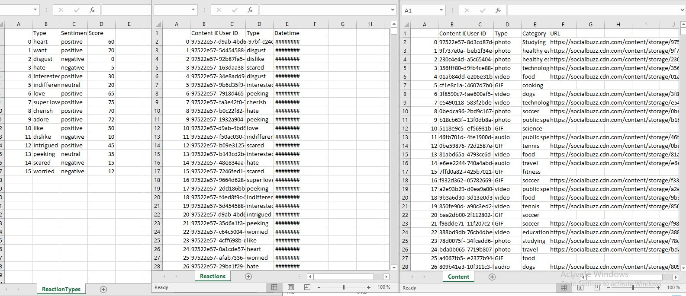
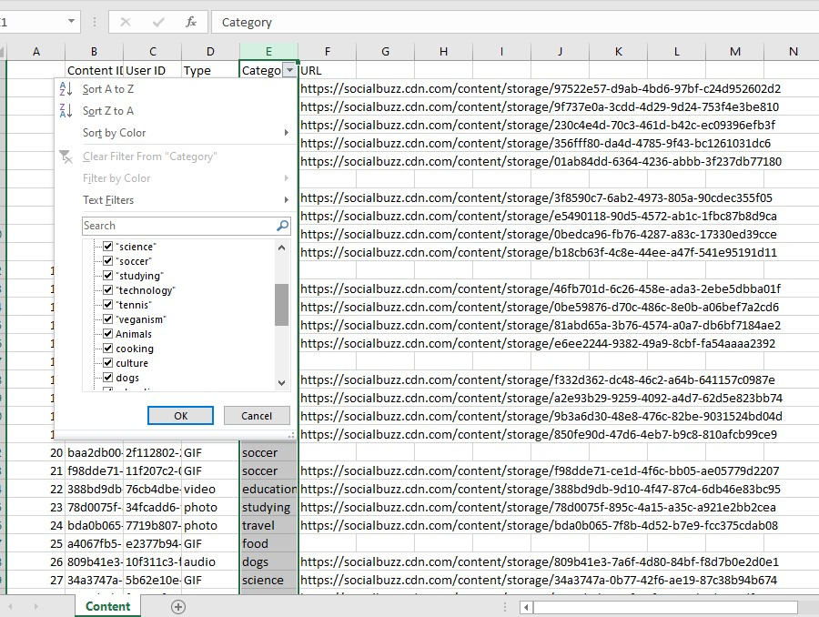
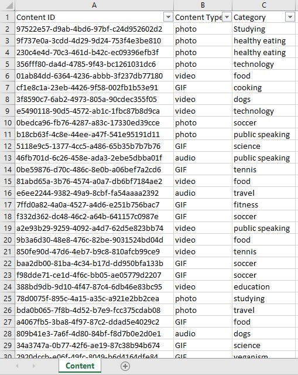
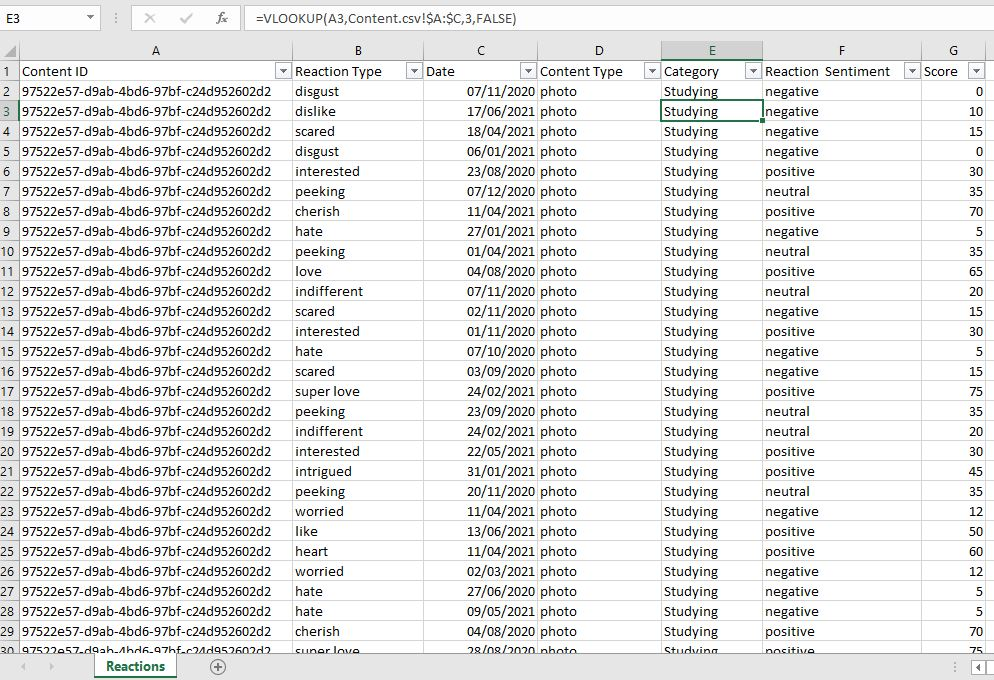
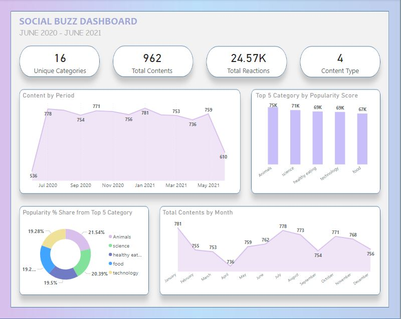
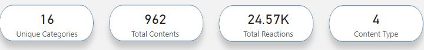
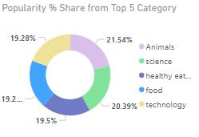
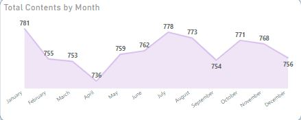

# SOCIAL BUZZ

## INTRODUCTION
I participated in the Accenture North America Virtual Experience Program via Forage, which provided me with the opportunity to work as a data analyst for a virtual organization called Social Buzz. In this project I will discuss my role and responsibilities in the program and provide insights into the outcomes achieved.
The Accenture North America Virtual Experience Program is designed to offer hands-on experience to students interested in pursuing a career in consulting, technology, or innovation. Through the program, I had the chance to work with team of diverse individual and collaborate on a project that involved analyzing data to help Social Buzz.

## PROJECT OVERVIEW AND PROBLEM STATEMENT
Social Buzz is a fast growing technology Unicom that need to adapt quickly to its global scale. Accenture has begun a POC focusing on these tasks
- An audit of their big data practice
- Recommendations for a successful IPO
- An analysis of their content categories that highlights the top 5 categories with the largest aggregate popularity
### My Job Role
My primary role was to gather, analyze and intepret data to help Social Buzz make informed decisions. Worked with my team to identify patterns and trends in the data and use these insights to create solutuions to imporove Social Buzz performance. I also helped to create data visualisations to communicate the findings to the organizations stakeholders.
### Business Questions
- How many unique categories are there ?
- How many reactions are there to the most popular category?
- What is the month with the highest post?

## TOOLS USED
Microsoft Excel, Microsoft PowerPoint, Microsoft Power BI.

## DATA EXPLORATION
Data exploration was done on the three datasets (Content, Reaction And Reaction Type). Exploration allows for a deeper understanding of a dataset, making it easier to navigate and use the data later. The better analyst know the data i'm working with, the better the analysis will be.

## DATA CLEANING
Data cleaning is the process of detecting and correcting inaccurate data set. Identifying the errors, validating the data will increase productivity and allow high-quality information in decision-making. The cleaning was  done by:
-	Removing rows that have values which are missing,
-	Changing the data type of some values within a column, and 
-	Removing columns which are not relevant to this project.

Uncleaned Data                          |        Cleaned Data
:--------------------------------------:|:-----------------------------------------------|
                       |          

## DATA TRANSFORMATION
Transformation is the process of converting data from one structure into another structure or format. I did this to help me improve the quality, consistency and usability of the data.
The three tables were merged using the ‘Reaction table’  as the base table to merge with the ‘Content  table’ and ‘Content ID’ was used as the Unique Identifier. Then it was merged with the ‘Reaction Type’ table using ‘Type’ as the Unique Identifier. This was done with the VLOOKUP function.

## ANALYSIS AND VISUALIZATION
With our new dataset, we used our analytical expertise to uncover insights from this dataset and to produce visualizations to describe the insights.
### VISUALIZATION

### ANALYSIS

From your data i found that there was a total of 16 unique categories of posts across the sample dataset. This includes things such as Food, Science and Animals.
As well as this, there were 962 contents from the period of June 2020 – June 2021 
The total reactions generated from the contents are 24574
And also 4 unique content type which includes Gif, audio, photo and video.

From the analysis, you can see that the top 5 most popular categories of posts were animals, science, healthy eating, technology and food in descending order. 
Animals had a popularity score of around 74965. It is very interesting to see both food and healthy eating within the top 5, it really shows that food is a highly engaging content category. Healthy eating ranks slightly higher than food, so perhaps the user base may be skewed towards healthy eaters and health-conscious people.
Finally, its also interesting to see science and technology too. This may suggest that people enjoy consuming factual content and snippets of content that they can learn something from.

Additionally, you can see from this chart the % share of popularity between the top 5 categories. There is not much difference between the share of each category, however, the difference between the 1st most popular, animals and the 2nd most popular, science, is the largest gap equal to 1.1%.
In business terms, this could suggest that the most popular category, animals, is tailing away from the rest of the categories and may continue to get more and more popular. To avoid an issue where 1 content category consumes the entire platform, it will be important to ensure that any algorithms used to govern the content on the platform gives a fair balance to the content categories.

And also the most common month for users to post within was January. This aligns with seasonal trends of social media users that feel the need to reconnect with people after calendar events such as Christmas.

## CONCLUSION AND RECOMMENDATION
1.	Animals and science are the two most popular categories of content, showing that people enjoy “real-life” and factual” content the most.
2.	I also found that food was a common theme amongst popular content and the most popular food category was healthy eating. This could be a signal to show the types of people that are using your platform, and you could use this insight to boost engagement even further. For example, you could run a campaign with content focused on this category or work with healthy eating brands to promote content.

